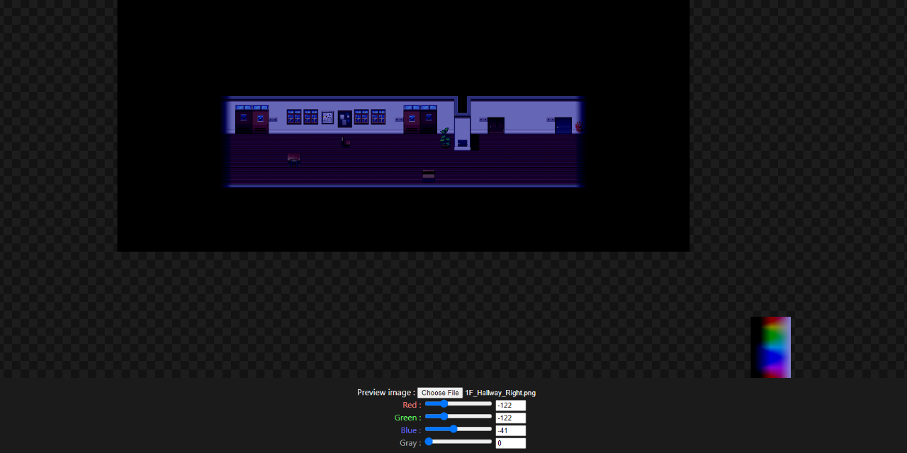

# RPG Maker tone previewer

It's tool about previewing RPG Maker's tone control with your any images.

[Open tool](https://creta5164.github.io/rpg-maker-tone-previewer)

---

### Used libraries
- pixi.js (4.8.8) ([GitHub](https://github.com/pixijs/pixi.js))
- JsExtensions, ToneFilter from rpgtkoolmv/corescript ([GitHub](https://github.com/rpgtkoolmv/corescript))
- Spoqa Han Sans ([Homepage](https://spoqa.github.io/spoqa-han-sans/en-US))